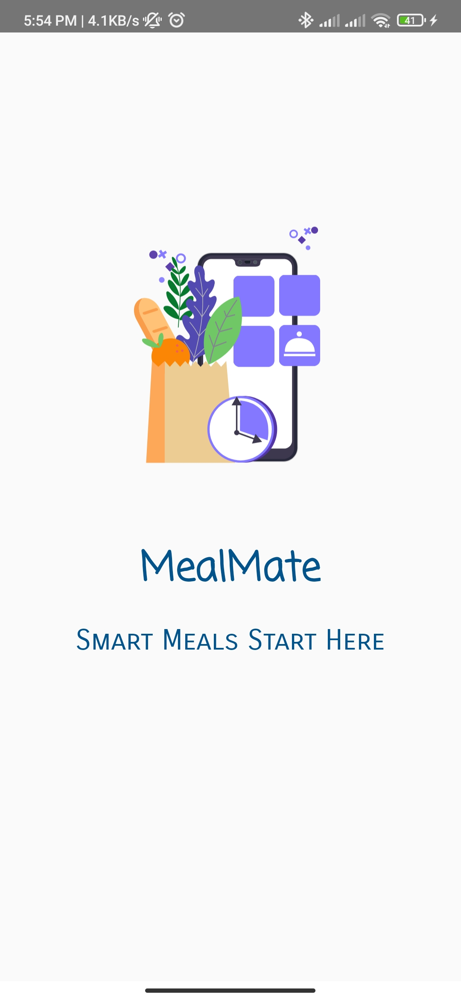

# MealMate

## Brief Description
MealMate is an Android mobile application designed to assist users in planning their weekly meals. With features like viewing categories, suggesting meals, searching for specific meals using various criteria, and saving favorite meals for offline browsing,MealMate aims to streamline meal planning and make it more convenient for users. The application utilizes the ((https://themealdb.com/api.php)) to provide a wide range of meal options.

## Project Features

- **Meal of the Day**: Users can view a randomly selected meal for inspiration.
  

- **Search Functionality**: Users can search for meals based on country, ingredient, or category.
  

- **Categories**: Displays a list of available categories for users to choose from.
  

- **Country-wise Meals**: Shows popular meals from different countries.
  

- **Favorite Meals**: Users can add meals to favorites or remove them. (Local storage using Room, Firebase not allowed)
  

- **Data Synchronization**: Users can synchronize and backup their data for access across devices. (Firebase)
  

- **Weekly Meal Planning**: Users can view and add meals for the current week.
  

- **Offline Access**: Users can access favorite meals and weekly meal plans even without an internet connection.
  

- **Authentication**:
  - Simple login and signup options, including social networking authentication (Firebase authentication).
  - Registered users can access their archived data upon successful login without needing to log in again (Local SharedPreferences, Firebase).
  - Guest mode allows users to access basic features like viewing categories, searching, and viewing the meal of the day.
  

- **Meal Details**: Provides detailed information about each meal, including name, image, origin country, ingredients, preparation steps, and an embedded video.
  

- **Splash Screen**: Displays a splash screen with animation using Lottie.
  

## Installation
To install MealMate on your device:

1. Download the app file from the ((https://github.com/mohamedallam01/MealMate.git)).

## Usage
1. Launch the MealMate app on your device.
2. Log in or sign up to access personalized features or use the app in guest mode.
3. Explore categories, search for meals, and plan your weekly meals.
4. Add your favorite meals for quick access.
5. Enjoy the convenience of meal planning with Meal Planner!

## Contributing
Contributions to the Meal Planner project are welcome! If you have any suggestions, feature requests, or bug reports, please open an issue or submit a pull request on the [GitHub repository](https://github.com/mohamedallam01/MealMate.git).

## License
This project is licensed under the ([ITI](https://iti.gov.eg/)). Feel free to use, modify, and distribute the code for your own purposes.
